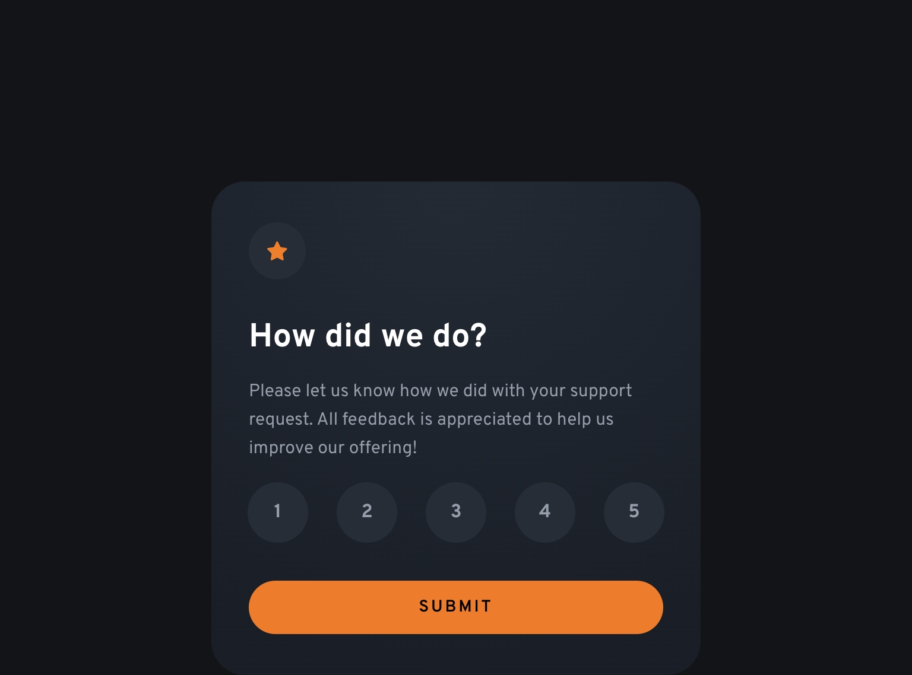
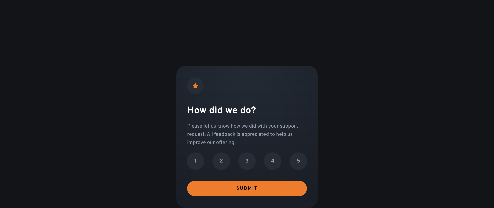

# Frontend Mentor - Interactive rating component solution

This is a solution to the [Interactive rating component challenge on Frontend Mentor](https://www.frontendmentor.io/challenges/interactive-rating-component-koxpeBUmI). Frontend Mentor challenges help you improve your coding skills by building realistic projects. 

## Table of contents

- [Frontend Mentor - Interactive rating component solution](#frontend-mentor---interactive-rating-component-solution)
  - [Table of contents](#table-of-contents)
  - [Overview](#overview)
    - [The challenge](#the-challenge)
    - [Screenshot](#screenshot)
    - [Links](#links)
  - [My process](#my-process)
    - [Built with](#built-with)
    - [What I learned](#what-i-learned)
  - [Author](#author)

## Overview

### The challenge

Users should be able to:

- View the optimal layout for the app depending on their device's screen size
- See hover states for all interactive elements on the page
- Select and submit a number rating
- See the "Thank you" card state after submitting a rating

### Screenshot

### Links

- Solution URL: [https://github.com/ReiRev/frontendmentor/tree/main/interactive-rating/tailwindcss](https://github.com/ReiRev/frontendmentor/tree/main/interactive-rating/nextjs-ts-tailwind)
- Live Site URL: [https://reirev.github.io/frontendmentor/interactive-rating/nextjs-ts-tailwind](https://reirev.github.io/frontendmentor/interactive-rating/nextjs-ts-tailwind)

## My process

### Built with

- Next.js
- Typescript
- Tailwind CSS
- CSS

### What I learned

- How to use form with React.

## Author

- Website - [My Home Page](https://reirev.net/)
- Frontend Mentor - [@ReiRev](https://www.frontendmentor.io/profile/ReiRev)
- X - [@RevRei2913](https://www.twitter.com/RevRei2913)
