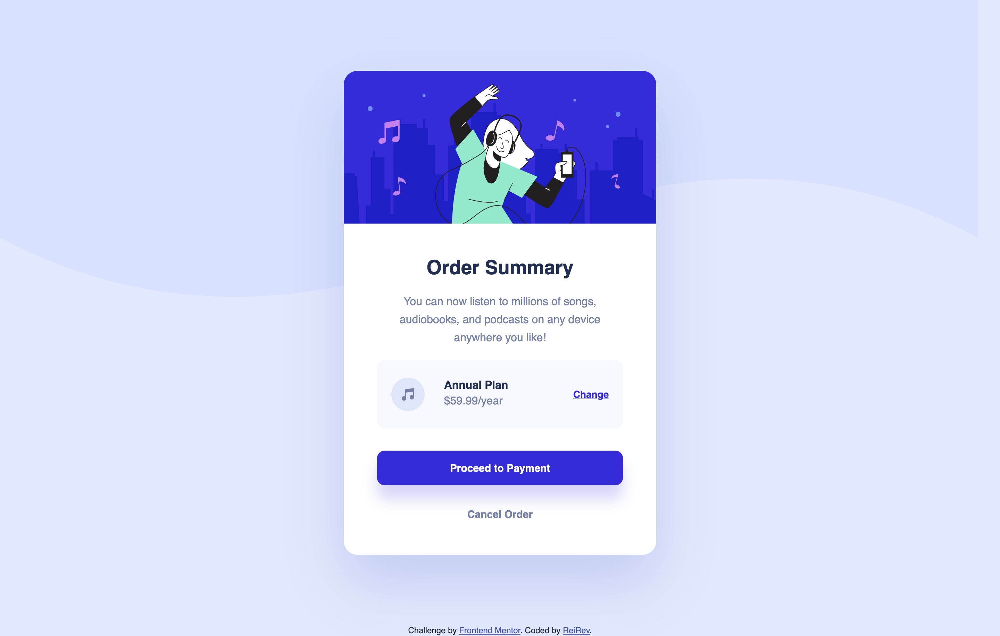

# Frontend Mentor - Order summary card solution

This is a solution to the [Order summary card challenge on Frontend Mentor](https://www.frontendmentor.io/challenges/order-summary-component-QlPmajDUj). Frontend Mentor challenges help you improve your coding skills by building realistic projects. 

## Table of contents

- [Frontend Mentor - Order summary card solution](#frontend-mentor---order-summary-card-solution)
  - [Table of contents](#table-of-contents)
  - [Overview](#overview)
    - [The challenge](#the-challenge)
    - [Screenshot](#screenshot)
    - [Links](#links)
  - [My process](#my-process)
    - [Built with](#built-with)
    - [What I learned](#what-i-learned)
  - [Author](#author)

## Overview

### The challenge

Users should be able to:

- See hover states for interactive elements

### Screenshot

### Links

- Solution URL: [https://github.com/ReiRev/frontendmentor/tree/main/order-summary-component/tailwindcss](https://github.com/ReiRev/frontendmentor/tree/main/order-summary-component/tailwindcss)
- Live Site URL: [https://reirev.github.io/frontendmentor/order-summary-component/tailwindcss/](https://reirev.github.io/frontendmentor/order-summary-component/tailwindcss/)

## My process

### Built with

- Tailwind CSS (CDN)

### What I learned

- How to set margin to absolute element.
  - [html - CSS absolute position won't work with margin-left:auto margin-right: auto - Stack Overflow](https://stackoverflow.com/questions/9998260/css-absolute-position-wont-work-with-margin-leftauto-margin-right-auto)

## Author

- Website - [My Home Page](https://reirev.net/)
- Frontend Mentor - [@ReiRev](https://www.frontendmentor.io/profile/ReiRev)
- X - [@RevRei2913](https://www.twitter.com/RevRei2913)
