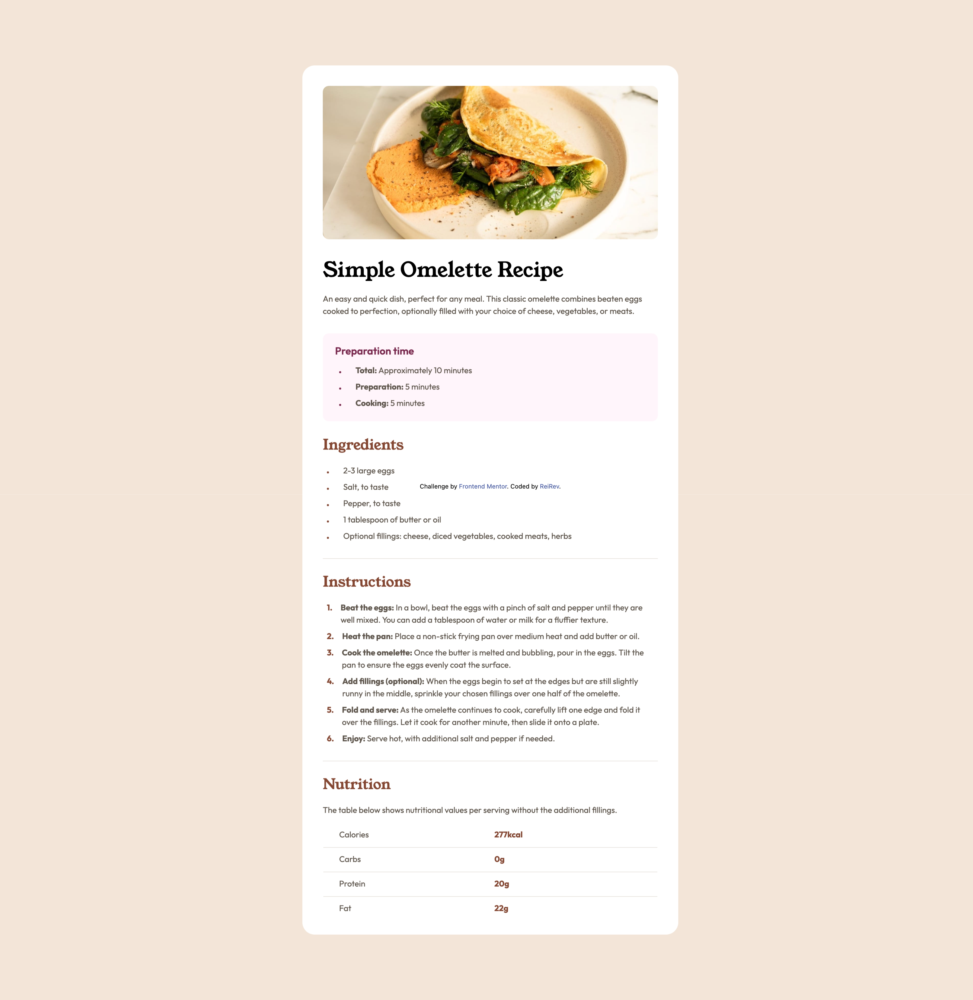

# Frontend Mentor - Recipe page solution

This is a solution to the [Recipe page challenge on Frontend Mentor](https://www.frontendmentor.io/challenges/recipe-page-KiTsR8QQKm). Frontend Mentor challenges help you improve your coding skills by building realistic projects. 

## Table of contents

- [Frontend Mentor - Recipe page solution](#frontend-mentor---recipe-page-solution)
  - [Table of contents](#table-of-contents)
  - [Overview](#overview)
    - [Screenshot](#screenshot)
    - [Links](#links)
  - [My process](#my-process)
    - [Built with](#built-with)
    - [What I learned](#what-i-learned)
  - [Author](#author)

## Overview

### Screenshot



### Links

- Solution URL: [https://github.com/ReiRev/frontendmentor/tree/main/recipe-page/tailwindcss](https://github.com/ReiRev/frontendmentor/tree/main/recipe-page/tailwindcss)
- Live Site URL: [https://reirev.github.io/frontendmentor/recipe-page/tailwindcss/](https://reirev.github.io/frontendmentor/recipe-page/tailwindcss/)

## My process

### Built with

- Tailwind CSS (CDN)

### What I learned

In the Figma design file, dividers with a height of 0px and a stroke height of 1px are used. To implement this, I needed to create a divider like the following:

```html
<div class="h-0">
    <div class="h-[1px] w-full box-content bg-stone-150"></div>
</div>
```

In the implementation above, the content of the divider overflows.

Dividers are also used in tables. In this case, I needed to wrap the divider with `<td>`.

## Author

- Website - [My Home Page](https://reirev.net/)
- Frontend Mentor - [@ReiRev](https://www.frontendmentor.io/profile/ReiRev)
- X - [@RevRei2913](https://www.twitter.com/RevRei2913)
