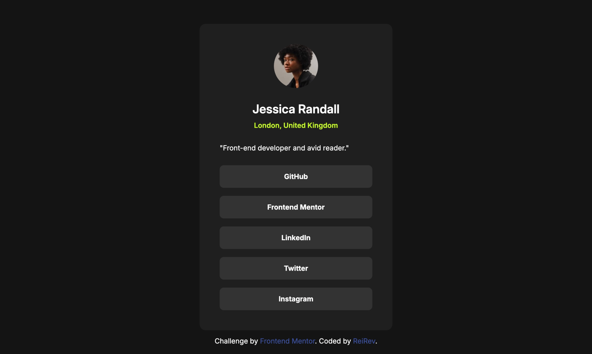

# Frontend Mentor - Social links profile solution

This is a solution to the [Social links profile challenge on Frontend Mentor](https://www.frontendmentor.io/challenges/social-links-profile-UG32l9m6dQ). Frontend Mentor challenges help you improve your coding skills by building realistic projects. 

## Table of contents

- [Frontend Mentor - Social links profile solution](#frontend-mentor---social-links-profile-solution)
  - [Table of contents](#table-of-contents)
  - [Overview](#overview)
    - [The challenge](#the-challenge)
    - [Screenshot](#screenshot)
    - [Links](#links)
  - [My process](#my-process)
    - [Built with](#built-with)
    - [What I learned](#what-i-learned)
    - [Useful resources](#useful-resources)
  - [Author](#author)

## Overview

### The challenge

Users should be able to:

- See hover and focus states for all interactive elements on the page

### Screenshot

### Links

- Solution URL: [https://github.com/ReiRev/frontendmentor/tree/main/social-links-profile/tailwindcss](https://github.com/ReiRev/frontendmentor/tree/main/social-links-profile/tailwindcss)
- Live Site URL: [https://reirev.github.io/frontendmentor/social-links-profile/tailwindcss/](https://reirev.github.io/frontendmentor/social-links-profile/tailwindcss/)

## My process

### Built with

- Tailwind CSS (CDN)

### What I learned

- ease-in/out

### Useful resources

- [CSSイージングのお手本- ease-out, ease-in, linearの使い分け](https://ics.media/entry/18730/)

## Author

- Website - [My Home Page](https://reirev.net/)
- Frontend Mentor - [@ReiRev](https://www.frontendmentor.io/profile/ReiRev)
- X - [@RevRei2913](https://www.twitter.com/RevRei2913)
